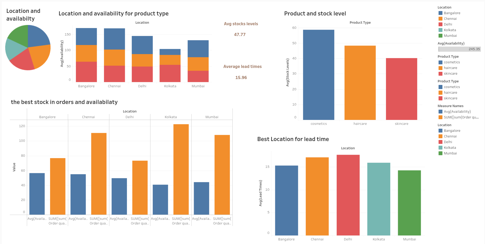
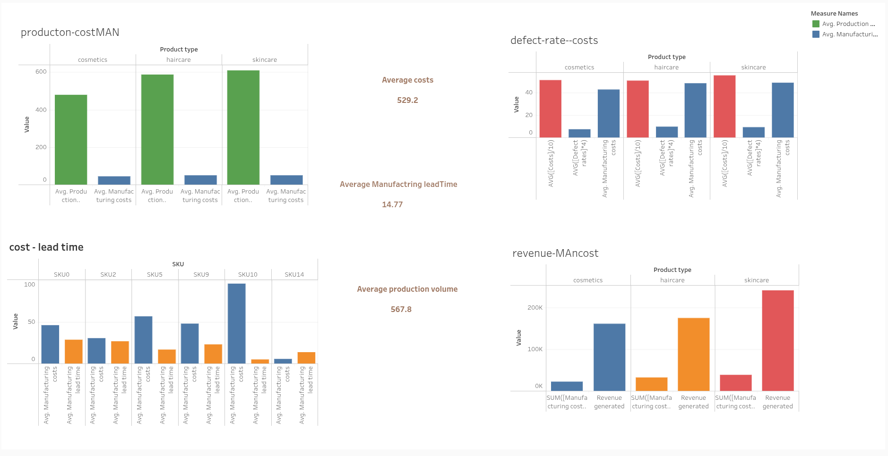
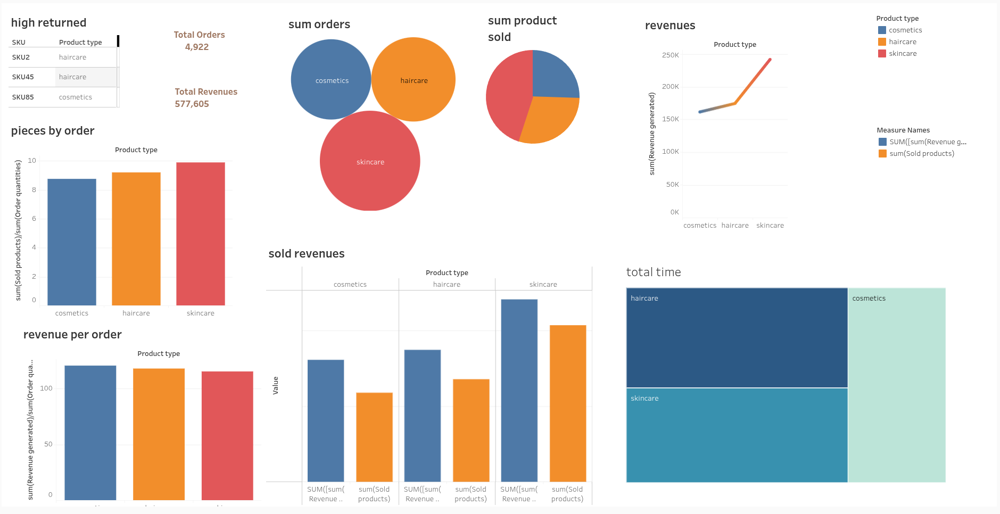
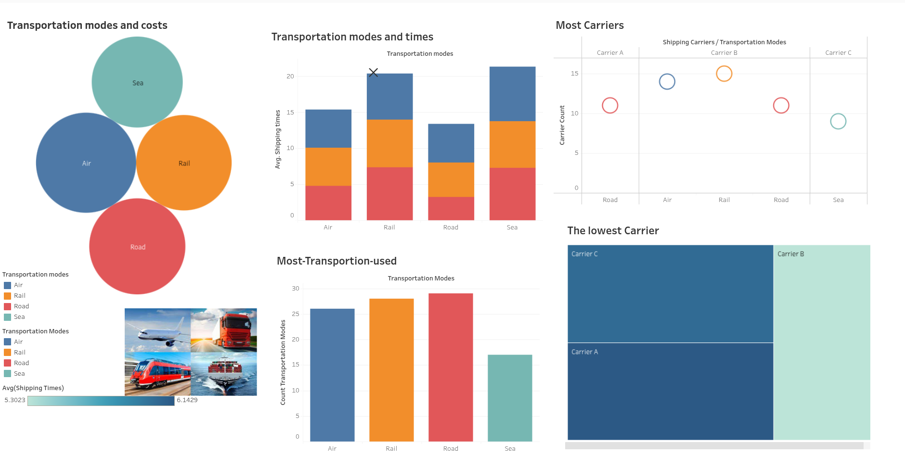

# 📊 Supply Chain Data Analysis

> A comprehensive end-to-end data analysis project examining supply chain operations, from supplier management to customer delivery.

[](https://www.python.org/)
[](https://www.Mysql.org/)
[](https://www.tableau.com/)

---

## Overview

This project provides a deep dive into supply chain analytics, covering the entire lifecycle from raw material sourcing to final product delivery. Using a combination of Python for data cleaning and exploration, SQL for data modeling and querying, and Tableau for visualization, we analyze key performance indicators across manufacturing, warehousing, transportation, and sales.

**Objectives:**
- Identify bottlenecks in the supply chain process
- Optimize inventory management and stock levels
- Analyze supplier performance and defect rates
- Evaluate transportation efficiency and costs
- Uncover sales patterns and revenue drivers

---

## 🔄 Supply Chain Cycle

```
Suppliers → Manufacturing → Warehousing → Distribution → Customers
```

1. **Suppliers**: Raw materials are sourced from suppliers
2. **Manufacturing**: Raw materials are transformed into finished goods
3. **Warehousing**: Products are stored in warehouses until needed
4. **Distribution**: Goods are transported from warehouses to customers

---

## Tech Stack

| Tool | Purpose |
|------|---------|
| **Excel** | Initial data exploration and validation |
| **Python** | Data cleaning, preprocessing, and exploratory analysis |
| └─ Pandas | Data manipulation and transformation |
| └─ Matplotlib | Data visualization |
| └─ Seaborn | Statistical visualizations |
| **SQL** | Data modeling and complex queries |
| **Tableau** | Interactive dashboard creation |

---

## Project Workflow

### **Step 1: Data Quality Assessment**
- ✅ Comprehensive data understanding
- ✅ Quality checks performed:
  - No null values detected
  - Data types validated
  - Outliers identified and handled
  - Data completeness verified
- ✅ Database created with flat table structure
- ✅ Data ready for analysis

### **Step 2: Question Generation**
Generated comprehensive analysis questions across five key areas:
- Manufacturing efficiency
- Supplier performance
- Warehousing operations
- Transportation logistics
- Sales and revenue

### **Step 3: Data Exploration & Querying**
- Python-based exploratory data analysis
- Complex SQL queries for in-depth insights
- Statistical analysis and pattern recognition

### **Step 4: Visualization**
- Interactive Tableau dashboard
- Visual answers to all analysis questions
- KPI tracking and trend analysis

---

## 📊 Data Dictionary

### Product Information
| Column | Description |
|--------|-------------|
| **Product type** | Category of product being sold |
| **SKU** | Unique identifier for each product |
| **Price** | Cost of the product to the customer |
| **Availability** | Percentage of products available at a given time |

### Sales Metrics
| Column | Description |
|--------|-------------|
| **Number of products sold** | Quantity of pieces sold |
| **Revenue generated** | Total earnings from sales |
| **Customer demographics** | Customer gender information |
| **Order quantities** | Number of orders placed |

### Inventory Management
| Column | Description |
|--------|-------------|
| **Stock levels** | Amount of inventory available at any given time |
| **Lead times** | Time from ordering a product until it is available |
| **Location** | Warehouse placement |

### Manufacturing
| Column | Description |
|--------|-------------|
| **Production volumes** | Quantity of products manufactured over a given period |
| **Manufacturing lead time** | Time required to produce the product |
| **Inspection results** | Quality inspection data before shipping |
| **Defect rates** | Percentage of defective products |

### Logistics
| Column | Description |
|--------|-------------|
| **Shipping times** | Duration to transport product from warehouse to customer |
| **Shipping carriers** | Companies responsible for transportation |
| **Shipping costs** | Expense associated with product transportation |
| **Transportation mode** | Method of transport used (Air, Road, Sea, Rail) |
| **Routes** | Paths taken by transport carriers |

### Lead Time Definitions
- **Lead time**: Time supplier takes to fulfill an order
- **Lead times**: Time from ordering a product until it is available
- **Manufacturing lead time**: Time to manufacture the product

---

## 🔍 Analysis Questions

<details>
<summary><b>📦 Stock & Inventory</b></summary>

- Which locations have the highest availability?
- What is the relation between lead times and availability?
- Which locations have the latest lead times?
- Is high availability with large order quantities indicating satisfactory stock?
- Which product type requires the most stock?
- Does stock level match production volumes?

</details>

<details>
<summary><b>🏭 Supplier Performance</b></summary>

- Supplier vs. defect rate analysis
- Supplier vs. lead time correlation
- Supplier vs. production volumes
- Supplier vs. products sold
- Most reliable suppliers
- Supplier vs. inspection results
- Supplier vs. product type specialization

</details>

<details>
<summary><b>⚙️ Manufacturing</b></summary>

- Manufacturing lead time vs. cost
- Cost vs. production volume relationship
- Cost vs. product type analysis
- Defect rate vs. cost correlation
- Defect rate vs. product type
- Inspection results vs. cost and lead time
- Lead time vs. defect rate

</details>

<details>
<summary><b>🚚 Transportation & Logistics</b></summary>

- Most frequently used transportation modes
- Impact of transportation modes on shipping costs and times
- Fastest delivery transportation mode
- Shortest and longest shipping times by mode
- Carrier impact on shipping times and costs
- Carrier specialization by routes or transportation modes

</details>

<details>
<summary><b>💰 Product & Sales</b></summary>

- Revenue by product type
- Units sold by product type
- Orders by product type
- Products sold per order
- Revenue per order by product type
- Price vs. units sold relationship
- Units vs. revenue correlation
- Orders with highest return rates
- Total time required per product

</details>

---

## 📊 Dashboard

Our interactive Tableau dashboard provides comprehensive visualizations across four key areas of the supply chain:

### Stock & Inventory Analysis


### Manufacturing Performance


### Product & Sales Insights


### Transportation & Logistics


---

## 📁 Project Structure

```
Py-SQL-Tableau-Data_Analysis/
│
├── assets/                         # Dashboard screenshots
├── data/                           # Raw and processed data files
├── SupplyChainExploration.ipynb   # Python analysis notebook
├── Supplychain queries.sql        # SQL queries for analysis
├── SupplyChain.twbx               # Tableau dashboard
├── Supply Chain Doc..md           # Project documentation
└── README.md                      # This file
```

---
